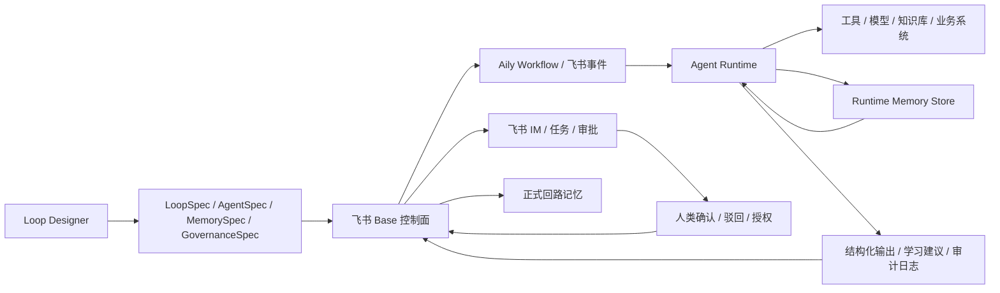

# 企业级业务回路智能体引擎设计稿

## 1. 目标

把现有“飞书 Base 客户投诉多智能体示范”升级为企业级业务回路构建引擎。

这个引擎不只是生成一张表、一个流程或几个提示词。它要解决的是：

> 如何让每个回路节点上的智能体拥有独立角色、技能、记忆和学习机制，同时又能共享整条业务回路的组织记忆，并接受人的治理。

首版目标不是做完整通用平台，而是跑通一条生产级薄切片：

1. Loop Designer 生成回路协议。
2. 飞书 Base 承载业务状态、协作视图、审计记录和人工确认。
3. Aily Workflow 或飞书事件负责触发和轻编排。
4. 外部 Agent Runtime 执行复杂智能体任务。
5. 智能体把结果、异常、经验和学习建议写回回路。
6. 人通过飞书 IM、任务或审批处理关键治理节点。

## 2. 设计判断

Aily 给出的混合架构方向是正确的，但需要收敛成一个统一协议，而不是三个系统的简单拼接。

核心分工如下：

| 层 | 承载方 | 职责 | 不负责 |
|---|---|---|---|
| 回路设计 | Loop Designer | 生成 LoopSpec、AgentSpec、MemorySpec、GovernanceSpec | 直接执行业务动作 |
| 业务状态 | 飞书 Base | 表格、视图、字段、记录、审计、人工协作 | 复杂智能体推理和长期语义记忆 |
| 触发编排 | Aily Workflow / 飞书事件 | 行变更、审批、IM、定时任务、轻量条件分支 | 多智能体长期规划、自我学习 |
| AI 执行 | 外部 Agent Runtime | 节点智能体、工具调用、记忆召回、策略判断 | 绕过飞书治理直接改业务事实 |
| 人类治理 | 飞书 IM / 审批 / 任务 | 确认、驳回、授权、升级、追责 | 被 AI 自动替代 |
| 组织记忆 | Base + Runtime Memory Store | 结构化经验、案例、规则、向量召回、版本 | 无来源、无版本的 prompt 堆料 |

一句话：

> 飞书是组织操作系统，外部 Runtime 是智能体执行系统，Loop Designer 是业务回路协议生成系统。

## 3. 三种方案

### 方案 A：飞书原生增强

继续用 Base、Aily Workflow 和内置 AI 节点完成更多自动化。

优点：

- 上手快。
- 易演示。
- 与飞书权限、视图、审批天然结合。

问题：

- 智能体容易退化为高级自动化脚本。
- 难以给每个节点智能体提供独立私有记忆、技能版本和长期学习机制。
- 复杂工具调用、跨系统执行和模型策略难以治理。

适用场景：样板间、咨询演示、低风险流程试点。

### 方案 B：混合 Runtime（推荐）

Loop Designer 生成协议，飞书承载业务状态和人类治理，外部 Runtime 执行节点智能体。

优点：

- 保留飞书的协作、审计、审批和组织普及能力。
- 智能体拥有真正的角色、技能、记忆和工具边界。
- 可以逐步接入知识库、向量记忆、业务系统 API、模型路由和运行监控。

问题：

- 需要定义稳定协议。
- 需要处理应用身份、权限、审计、幂等和失败恢复。

适用场景：企业级业务回路引擎。

### 方案 C：外部平台优先

把业务回路、任务流、状态和智能体全部放在独立平台中，飞书只做通知入口。

优点：

- AI 能力最自由。
- 技术架构统一。

问题：

- 组织协作、可视化、审批、审计和日常使用会远离真实工作场。
- 业务用户很难把它当成组织操作系统的一部分。

适用场景：企业内部已有强 AI 平台和统一工作台时。

结论：首版采用方案 B。

## 4. 核心协议

企业级引擎的关键不是“多几个表”，而是四个协议对象。

### 4.1 LoopSpec

定义一条业务回路本身。

必要字段：

| 字段 | 说明 |
|---|---|
| loopId | 回路唯一 ID |
| name | 回路名称 |
| businessGoal | 业务目标 |
| inputEvents | 可触发回路的事件 |
| nodes | 回路节点 |
| stateMachine | 状态机 |
| humanGates | 人工确认节点 |
| outputSignals | 回路输出和成效信号 |
| memoryPolicy | 记忆读写策略 |
| governancePolicy | 治理策略 |
| version | 协议版本 |

### 4.2 AgentSpec

定义一个节点智能体。

必要字段：

| 字段 | 说明 |
|---|---|
| agentId | 智能体唯一 ID |
| nodeId | 所属回路节点 |
| role | 节点角色，如感知、归因、裁决辅助、修复跟进、复盘学习 |
| responsibilities | 允许承担的责任 |
| forbiddenActions | 禁止动作 |
| inputContract | 输入字段和必要上下文 |
| outputContract | 输出结构和证据要求 |
| skills | 可调用技能 |
| tools | 可调用工具 |
| privateMemoryScopes | 私有记忆范围 |
| sharedMemoryScopes | 可读取的共享记忆范围 |
| modelPolicy | 模型、温度、token、失败降级策略 |
| escalationPolicy | 何时升级给人 |
| auditPolicy | 必须记录的审计信息 |

### 4.3 MemorySpec

定义记忆如何被读取、写入、验证和晋升。

记忆分四类：

| 类型 | 说明 | 示例 |
|---|---|---|
| 节点私有记忆 | 某个智能体自己的工作经验 | 归因智能体常见误判模式 |
| 回路共享记忆 | 整条回路可复用的经验 | 客诉升级规则、相似案例、赔付边界 |
| 治理记忆 | 人的确认、驳回、例外授权 | 某次高风险建议被主管驳回 |
| 学习候选记忆 | AI 提出的新经验，尚未生效 | 新分类规则草案、话术边界修订 |

每条记忆必须有：

| 字段 | 说明 |
|---|---|
| memoryId | 记忆唯一 ID |
| memoryType | 记忆类型 |
| scope | 适用范围 |
| content | 结构化内容 |
| source | 来源记录、任务、审批或人 |
| confidence | 置信度 |
| status | 候选、试运行、生效、停用 |
| version | 版本 |
| validUntil | 可选，有效期 |
| reviewOwner | 负责审核的人 |
| lastUsedAt | 最近使用时间 |
| outcome | 使用后的结果反馈 |

### 4.4 GovernanceSpec

定义智能体和人之间的治理规则。

必要字段：

| 字段 | 说明 |
|---|---|
| riskLevel | 节点风险级别 |
| approvalRequiredWhen | 触发人工确认的条件 |
| accountableRole | 对结果负责的人类角色 |
| notificationTarget | @对象或群 |
| sla | 处理时限 |
| privacyPolicy | 脱敏和可见范围 |
| rollbackPolicy | 错误输出或误动作如何回滚 |
| learningPromotionPolicy | 学习建议如何晋升为正式记忆 |

## 5. 数据流

关键原则：

1. Base 中的业务事实是协作和审计的主界面。
2. Runtime 可以维护更强的语义记忆和工具执行状态，但必须把摘要、来源和结果写回 Base。
3. 智能体不能直接把候选学习改成生效规则。
4. 人类确认不是装饰，而是风险边界和责任归属。

## 6. 首版客服回路薄切片

首版继续使用客户投诉场景，但要从“演示流”升级为“协议驱动运行”。

### 6.1 节点

| 节点 | 智能体 | 人类角色 | 输出 |
|---|---|---|---|
| 投诉进入 | 无或轻量结构化智能体 | 一线客服 | 原始投诉记录 |
| 结构化 | 投诉结构化智能体 | 客服主管 | 摘要、关键事实、缺失信息 |
| 归因 | 归因建议智能体 | 裁决人 | 根因假设、风险等级、证据、置信度 |
| 裁决 | 裁决辅助智能体 | 业务负责人 | 是否采纳、是否升级、责任团队 |
| 修复 | 修复跟进智能体 | 责任团队 | SLA、处理动作、回访任务 |
| 学习 | 复盘学习智能体 | 规则审核人 | 规则草案、异常模式、记忆候选 |

### 6.2 Runtime 必须实现的最小能力

| 能力 | 验收 |
|---|---|
| 读取事件 | 能接收 Base 行变更或模拟事件 |
| 加载协议 | 能按 loopId 和 nodeId 加载 AgentSpec |
| 召回记忆 | 能读取节点私有记忆和回路共享记忆 |
| 执行技能 | 能调用至少一个节点技能，如投诉结构化 |
| 写回结果 | 能写回结构化输出、运行日志、学习建议 |
| 触发人工 | 高风险、低置信度、缺信息时能生成 @通知或审批动作 |
| 幂等处理 | 同一事件重复触发不会重复创建业务记录 |

### 6.3 不做范围

首版不做：

- 自动生成全公司任意回路。
- 智能体自动修改自己的正式提示词。
- 智能体自动启用新规则。
- 绕过人工审批的赔付、客户承诺或组织调整。
- 把 Base 当作向量数据库使用。
- 把所有记忆都塞进 prompt。

## 7. 生产级治理规则

### 7.1 稳定应用身份

真实企业应用必须使用稳定的企业自建应用身份，而不是个人账号或临时机器人。

要求：

- 固定 appId / appSecret。
- 最小权限授权。
- 独立环境变量管理。
- 所有写操作带应用身份和触发来源。
- 关键动作保留人类责任人字段。

### 7.2 权限边界

每个智能体只能访问自己需要的字段和工具。

示例：

| 智能体 | 允许 | 禁止 |
|---|---|---|
| 投诉结构化智能体 | 读取原始投诉，写摘要和缺失信息 | 删除客户原话 |
| 归因建议智能体 | 写根因假设、风险等级、证据 | 直接关闭投诉 |
| 裁决辅助智能体 | 生成裁决草案 | 替人勾选最终放行 |
| 修复跟进智能体 | 创建修复任务和 SLA 提醒 | 直接对客户承诺赔付 |
| 复盘学习智能体 | 生成规则草案 | 直接把规则设为生效 |

### 7.3 学习晋升机制

自我学习分四步：

1. 智能体提出候选经验。
2. Runtime 写入学习候选记忆。
3. 人或治理规则审核。
4. 审核通过后晋升为试运行或生效记忆。

这能避免“模型一次判断错误，长期污染组织记忆”。

## 8. 技术落点

### 8.1 Loop Designer

新增或扩展：

- 回路协议导出器。
- AgentSpec 生成器。
- MemorySpec 生成器。
- GovernanceSpec 生成器。
- 飞书 Base 控制面映射。

### 8.2 飞书 Base

保留已有生产级配置表，并升级为协议映射表：

| 现有表 | 升级方向 |
|---|---|
| 智能体注册表 | 映射 AgentSpec |
| 智能体记忆库 | 映射 MemorySpec 的可见摘要和治理状态 |
| 智能体技能库 | 映射 SkillSpec |
| 智能体权限矩阵 | 映射 GovernanceSpec |
| 智能体运行日志 | 映射 Runtime 审计日志 |
| @通知与行动节点 | 映射 humanGates 和 escalationPolicy |

### 8.3 Agent Runtime

Runtime 应作为独立服务存在，至少包含：

- Event API：接收飞书事件或 Aily Workflow 回调。
- Agent Registry：加载 AgentSpec。
- Memory Service：读取私有记忆、共享记忆和候选学习。
- Skill Runner：执行节点技能。
- Tool Gateway：隔离飞书、业务系统和外部工具调用。
- Audit Logger：记录输入摘要、输出摘要、模型、工具、耗时、责任人。
- Governance Engine：判断是否需要人工确认、审批或升级。

### 8.4 记忆存储

短期：

- Base 保存可见、可审计、可人工维护的结构化记忆。
- Runtime 本地或数据库保存执行态记忆和检索索引。

中期：

- 接入向量检索。
- 引入相似回路召回。
- 与 Loop OS 回路资产和 Matrix Origin 治理记录关联。

长期：

- 形成组织级回路记忆层。
- 支持跨回路经验复用、冲突检测和治理演化建议。

## 9. 第一阶段实施清单

### 阶段 1：协议落地

交付物：

- `LoopSpec` JSON schema。
- `AgentSpec` JSON schema。
- `MemorySpec` JSON schema。
- `GovernanceSpec` JSON schema。
- 客服回路样例协议。

验收：

- 一条客服回路可以完整表达节点、智能体、记忆、人工关口和状态机。

### 阶段 2：Runtime 薄切片

交付物：

- 事件接收接口。
- 协议加载器。
- 一个投诉结构化智能体执行器。
- 运行日志写回。
- 学习候选写回。

验收：

- 模拟一条投诉事件后，Runtime 能按 AgentSpec 执行，并把输出写回控制面。

### 阶段 3：飞书治理闭环

交付物：

- 高风险或低置信度触发 @通知。
- 人工确认结果写回。
- 规则草案进入学习候选记忆。

验收：

- 用户能在飞书里直观看到“智能体建议 -> 人类确认 -> 记忆晋升”的完整链路。

### 阶段 4：Loop Designer 集成

交付物：

- 在设计器中生成协议。
- 导出到飞书 Base 控制面。
- Runtime 按协议执行。

验收：

- 用户不是手工搭表，而是从 Loop Designer 生成一条可运行、可治理、可学习的业务回路。

## 10. 成功标准

第一版成功不以“自动化程度最高”为标准，而以以下信号为准：

1. 每个节点智能体都有明确角色、输入、输出、禁止动作和升级条件。
2. 每次 AI 输出都有来源、证据、运行日志和责任边界。
3. 人能在飞书里看到自己何时需要确认、为什么需要确认、确认后会改变什么。
4. 记忆不是 prompt 文本堆积，而是有来源、版本、状态和适用范围。
5. 学习建议不会直接生效，必须经过治理晋升。
6. Loop Designer 能把一条回路从设计资产转成运行协议。
7. 外部 Runtime 能按协议执行至少一个节点智能体。

## 11. 关键风险

| 风险 | 表现 | 处理 |
|---|---|---|
| Base 被当成万能数据库 | 字段越来越多，记忆检索变慢，prompt 变长 | Base 只保存可见控制面和审计摘要，复杂检索交给 Runtime |
| 智能体越权 | AI 直接关闭投诉、承诺赔付、修改规则 | AgentSpec 和 GovernanceSpec 中显式禁止，Runtime 做拦截 |
| 记忆污染 | 错误经验被长期复用 | 候选、试运行、生效、停用四级状态 |
| 责任不清 | AI 做了建议，人不知道是否已放行 | 所有关键动作必须有 accountableRole |
| 演示强、生产弱 | 表面流程完整，真实异常无法处理 | 首版必须做幂等、审计、失败恢复和人工升级 |

## 12. 产品定位更新

原定位：

> Loop Designer 生成业务回路方案。

升级后：

> Loop Designer 生成可运行、可治理、可学习的业务回路协议。

对应产品能力从“设计器”升级为“业务回路构建引擎”：

- 设计回路。
- 定义节点智能体。
- 约束智能体权责。
- 配置节点记忆和共享记忆。
- 接入飞书运行控制面。
- 接入外部 Agent Runtime。
- 把运行反馈沉淀为组织记忆。

这也是从 Base 演示走向企业级产品的关键跃迁。
