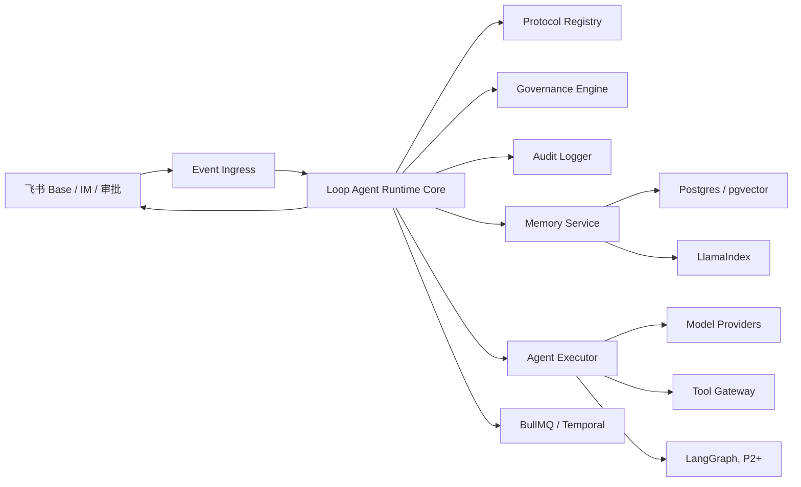

# 业务回路智能体 Runtime 框架最终建议

## 1. 结论

下一阶段不要选择单一开源 Agent 框架作为主 Runtime，也不要完全从零开发通用 Agent 平台。

推荐路线：

> 自建 Loop Agent Runtime Core，局部吸收 LangGraph、Temporal / BullMQ、LlamaIndex / pgvector、pi-agent、DeerFlow、OpenClaw、Hermes Agent 的成熟能力。

主控权必须留在自建 Runtime 中，因为本产品的核心不是“让智能体完成任务”，而是让业务回路在企业中可运行、可治理、可审计、可学习。

最终建议：

| 层级 | 推荐方案 | 说明 |
|---|---|---|
| 主 Runtime | 自建 `Loop Agent Runtime Core` | 负责协议、治理、审计、记忆晋升、飞书写回和企业身份 |
| Agent 图执行 | P2 引入 LangGraph | 只承担多节点状态图，不接管治理规则 |
| 长流程耐久执行 | P3 引入 Temporal，P1/P2 可用 BullMQ 过渡 | 处理跨天等待、SLA、回访、重试和恢复 |
| 记忆与检索 | Postgres + pgvector，必要时接 LlamaIndex | Base 做可见协作面，Runtime Memory Store 做语义记忆 |
| Agent harness 参考 | pi-agent / Hermes / OpenClaw / DeerFlow | 借鉴插件、技能、工具、沙箱、多通道交互，不作为核心控制面 |

判断标准很简单：凡是涉及业务事实、组织责任、审批边界、学习晋升和审计证据的能力，都必须留在自建 Runtime；凡是通用状态图、队列、长流程、向量检索和 agent harness 能力，可以使用成熟框架。

## 1.1 对候选框架的最终判断

| 框架 | 可以借鉴 | 不建议承担 | 结论 |
|---|---|---|---|
| OpenClaw | 自托管 assistant、gateway、技能和多通道交互 | 企业业务回路状态机、飞书审批、组织记忆晋升 | 可参考个人/团队 agent shell，不作为企业回路 runtime |
| Hermes Agent | 终端/TUI、长期会话、工具输出、多通道入口、模型/本地运行适配 | 企业治理协议、Base 写回、审批责任链 | 可参考 agent 操作体验和多 provider 运行，不作为主控 |
| pi-agent | TypeScript-first、tool calling、session state、extension/package 形态 | 多租户治理、审批、审计、记忆晋升 | 可作为 TypeScript agent core 参考 |
| DeerFlow | sandbox、skills、sub-agent、long-horizon task、SuperAgent 工作区 | 企业业务状态、合规审计、飞书协作面 | 可参考长任务和工作区，不作为业务回路内核 |
| LangGraph | graph、checkpoint、human-in-the-loop、状态恢复 | 业务权限、组织记忆、生效规则 | P2 后作为节点图执行器 |
| Temporal | durable execution、signal、retry、long-running workflow | Agent 推理、业务协议解释 | P3 后作为长流程耐久底座 |

所以不建议在 OpenClaw、Hermes、pi-agent、DeerFlow 之间“二选一”。正确做法是自建业务回路内核，再按层吸收它们的局部能力。

## 2. 推荐技术栈

### 2.1 主控内核：自建 Loop Agent Runtime Core

继续基于当前 NestJS / TypeScript Runtime 演进。

自建内核负责：

- `LoopSpec` 解释。
- `AgentSpec` 加载。
- `MemorySpec` 读写策略。
- `GovernanceSpec` 执行。
- 飞书事件入口。
- 企业自建应用身份。
- 幂等 `runId`。
- 审计日志。
- 人工确认门。
- 记忆候选晋升。
- 飞书 Base / IM / 审批写回。

这些能力属于业务回路产品的核心资产，不应交给通用 Agent 框架。

### 2.2 Agent 状态图：LangGraph

建议在 P2 引入，不作为 P1 必需项。

适合承担：

- 多节点 Agent 状态图。
- 分支、循环、暂停和恢复。
- human-in-the-loop 节点。
- checkpoint / state persistence。
- 多智能体协作执行。

使用边界：

- LangGraph 只做节点执行图。
- 不接管业务权限、飞书协作、记忆晋升和治理规则。
- 所有高风险动作仍由 `GovernanceSpec` 拦截。

### 2.3 长流程耐久执行：Temporal，轻量阶段可先用 BullMQ

如果企业回路会跨小时、跨天等待人审批，最终建议使用 Temporal。

Temporal 适合承担：

- 长时间等待。
- 自动重试。
- 失败恢复。
- 定时回访。
- SLA 超时。
- 人工审批后的继续执行。
- 可回放执行历史。

P1 如果只需要本地或单机试点，可以先用 BullMQ：

- Redis 队列。
- 后台任务。
- 重试。
- 延迟任务。

边界：

- BullMQ 是过渡方案。
- Temporal 是生产级长流程底座。

### 2.4 知识与记忆检索：LlamaIndex / pgvector

建议不要把飞书 Base 当向量数据库。

短期：

- Base 保存可见摘要、状态、审核人、版本和审计。
- Runtime 使用 Postgres 保存结构化记忆。

中期：

- 用 pgvector 或 LlamaIndex 做相似案例、规则、历史回路召回。

适合承担：

- RAG。
- 相似投诉召回。
- 相似回路召回。
- 规则证据卡。
- 文档知识索引。

边界：

- 召回结果只是上下文，不等于正式记忆。
- 正式记忆仍必须经过 `MemorySpec` 和治理晋升。

### 2.5 pi-agent 的借鉴位置

pi-agent 可作为 TypeScript Agent Loop 参考，不建议作为主控。

可借鉴：

- Agent core 结构。
- tool calling。
- session state。
- extension / package 思路。
- TypeScript-first 工程形态。

不建议交给它：

- 企业治理。
- 飞书审批。
- 组织记忆晋升。
- 高风险动作边界。
- 多租户审计。

### 2.6 OpenClaw / Hermes Agent 的借鉴位置

OpenClaw 和 Hermes Agent 更接近“自托管个人/团队 agent runtime”或“agent 操作系统外壳”，不适合作为业务回路引擎的治理内核。

可借鉴：

- 本地/自托管运行方式。
- gateway / 多通道入口。
- 技能包管理。
- 工具权限提示。
- 会话连续性。
- 模型 provider 适配。
- 人类远程审批体验。

不建议交给它们：

- 飞书 Base 中的业务事实写回。
- 企业应用身份与最小权限。
- 人工审批责任链。
- 回路级共享记忆晋升。
- 审计日志、版本和回滚。

### 2.7 DeerFlow 的借鉴位置

DeerFlow 更适合参考长任务 SuperAgent 和工作区能力，不建议作为业务回路 Runtime 内核。

可借鉴：

- sandbox。
- sub-agent。
- skills。
- long-horizon task。
- research / coding / creation 工作区。

不建议交给它：

- 企业业务状态机。
- 飞书 Base 写回。
- 审计与合规。
- 人工确认规则。

## 3. 分阶段架构

### P1：自建 Runtime Core

目标：让一条客服投诉回路进入可运行、可测试、可审计状态。

保留当前 NestJS Runtime，继续完善：

- standalone 企业后端模式。
- 飞书事件 webhook。
- webhook 签名校验。
- 协议 registry。
- 模型 provider adapter。
- 工具调用 adapter。
- 运行日志持久化。
- 记忆候选持久化。
- Base 写回 adapter。
- IM / 审批通知 adapter。

P1 不引入 LangGraph / Temporal 作为硬依赖。

原因：

- 当前最重要的是把业务协议、治理边界、飞书写回跑稳。
- 过早引入大型执行框架会掩盖产品协议问题。

### P2：引入 LangGraph

触发条件：

- 一个回路内出现 3 个以上智能体节点。
- 节点之间有条件分支、循环、暂停、恢复。
- 需要清晰可视化或可回放的 Agent 状态图。

引入方式：

- `LoopSpec.nodes` 编译为 LangGraph graph。
- `GovernanceSpec.humanGates` 编译为中断节点。
- 每个 LangGraph node 调用自建 `AgentExecutor`。
- 所有结果仍写回自建 Runtime 的 `RunLog`。

### P3：引入 Temporal

触发条件：

- 回路需要跨小时或跨天等待人工。
- 需要 SLA、重试、超时、补偿、回访。
- 企业要求可恢复、可回放、可审计的长流程。

引入方式：

- Temporal workflow 只负责耐久编排。
- Runtime Core 仍负责协议、治理、记忆和审计。
- 飞书审批结果作为 workflow signal。

### P4：接入 LlamaIndex / pgvector 记忆层

触发条件：

- 需要相似案例召回。
- 需要跨回路经验复用。
- 需要组织记忆进入生成上下文。

引入方式：

- Runtime 写入结构化记忆。
- pgvector 保存 embedding。
- LlamaIndex 负责索引和召回。
- Base 展示可审计摘要。

## 4. 推荐目标架构

## 5. 不建议路线

### 不建议 1：直接用 DeerFlow 做核心

原因：

- 产品重心偏 SuperAgent，不是企业业务回路治理。
- 容易把组织治理问题变成 Agent 自动执行问题。

### 不建议 2：直接用 pi-agent 做核心

原因：

- 可以借鉴工程结构，但企业审批、审计、记忆晋升仍要自建。
- 如果直接接管主控，会反过来限制 `LoopSpec / GovernanceSpec` 的表达。

### 不建议 3：一开始就上 LangGraph + Temporal + LlamaIndex 全套

原因：

- 会显著增加复杂度。
- 当前阶段还没有多节点长流程压力。
- 先把协议和治理跑稳，比堆框架更重要。

### 不建议 4：完全从头开发所有能力

原因：

- 状态图、长流程、RAG、队列都有成熟方案。
- 自研应集中在业务回路协议和治理内核，而不是重复造通用基础设施。

## 6. 下一阶段开发建议

下一阶段按这个顺序做：

### 6.1 P1：Runtime Core 工程化

目标：摆脱妙搭订阅依赖，让客服投诉回路具备真实企业部署骨架。

开发项：

1. 固化 standalone Runtime，支持 Docker / PM2 / 云服务器部署。
2. 增加 webhook 签名校验，支持飞书企业自建应用回调。
3. 抽出 `Pipeline + Step` 编排层，避免 `AgentService` 继续膨胀。
4. 增加 Runtime 持久化，先用 SQLite 或 Postgres，保存 `RunLog`、`GovernanceDecision`、`LearningCandidate`。
5. 增加 Base 写回 adapter，把结构化输出、运行日志和候选记忆写回飞书。
6. 增加模型 provider adapter，支持 OpenAI-compatible、私有模型、本地规则降级。
7. 增加 IM adapter 和 Approval adapter，实现真实人工确认门。
8. 增加配置中心，把 Base token、table id、agent spec、治理阈值从代码中移出。

P1 暂不引入 LangGraph / Temporal 作为硬依赖。这个阶段的成功标准不是“智能体看起来更聪明”，而是协议、权限、审计、人工确认和写回链路可靠。

### 6.2 P2：回路状态机与多节点编排

触发条件：

- 客服回路至少跑通 3 个以上节点。
- 需要节点状态：待处理、执行中、待人工、已通过、已驳回、超时。
- 需要条件分支、暂停恢复、失败重试。

开发项：

1. 新增 `LoopInstance` 和 `NodeRun`。
2. 将 `LoopSpec.nodes` 编译为内部状态机。
3. 引入 LangGraph 作为可选执行器。
4. 将 `GovernanceSpec.humanGates` 编译为 interrupt / resume 节点。
5. 所有节点输入、输出、证据和治理判断继续写入自建 `RunLog`。

### 6.3 P3：生产级长流程

触发条件：

- 审批或回访跨小时/跨天。
- 需要 SLA、超时升级、定时回访和补偿动作。
- 企业要求服务重启后自动恢复。

开发项：

1. 接入 Temporal。
2. 飞书审批结果作为 Temporal signal。
3. SLA 和回访作为 durable timer。
4. 外部 API 调用作为 activity，统一重试和补偿。
5. Runtime Core 仍然负责业务协议、治理和审计。

### 6.4 P4：组织记忆与自我学习

触发条件：

- 同类投诉、规则、回路经验需要复用。
- 学习候选需要从“草案”进入“试运行”和“生效”。

开发项：

1. 建立 Runtime Memory Store。
2. 用 Postgres + pgvector 存储结构化记忆和 embedding。
3. 需要复杂索引时接入 LlamaIndex。
4. 设计 `LearningPromotionWorkflow`：候选、审核、试运行、回测、生效、停用。
5. Base 展示可审计摘要，Runtime 维护可检索语义上下文。

## 7. 建议的下一阶段任务拆分

按工程优先级拆成 5 个开发包：

| 开发包 | 目标 | 主要模块 |
|---|---|---|
| A. Runtime Core 重构 | 让当前客服 Runtime 可持续扩展 | `PipelineContext`、`PipelineStep`、`AgentExecutor`、`GovernanceEngine` |
| B. 飞书生产 adapter | 从 dry-run 进入企业真实协作 | `FeishuWebhookVerifier`、`BaseWriteAdapter`、`ImAdapter`、`ApprovalAdapter` |
| C. 持久化与审计 | 让每次执行可恢复、可追溯 | `RunLogStore`、`DecisionStore`、`LearningCandidateStore` |
| D. 协议与配置注册表 | 从客服专用走向多回路 | `ProtocolRegistry`、`AgentRegistry`、`FieldMappingRegistry`、`ConfigService` |
| E. 记忆与学习闭环 | 让智能体真正积累经验 | `MemoryStore`、`Retriever`、`LearningPromotionWorkflow` |

开发顺序建议：A → B → C → D → E。LangGraph 放在 D 之后，Temporal 放在 SLA 和跨天等待出现之后。

## 8. 一句话原则

> Runtime Core 自建，Agent Graph 借 LangGraph，长流程借 Temporal，记忆检索借 LlamaIndex / pgvector，轻量队列可先用 BullMQ，pi-agent 和 DeerFlow 只作为工程与能力参考。

这能保证企业级业务回路的主权、治理和组织记忆留在自己的产品内核中，同时避免重复开发通用 Agent 基础设施。

## 9. 参考资料

- OpenClaw：自托管个人 AI assistant、gateway、多通道交互。<https://github.com/openclaw/openclaw>
- Hermes Agent：TUI、会话连续性、多通道入口、模型/工具运行。<https://github.com/NousResearch/hermes-agent>
- LangGraph：状态图、checkpoint、human-in-the-loop、多智能体执行。<https://docs.langchain.com/oss/python/langgraph/persistence>
- Temporal：durable execution、长流程、重试、恢复、信号。<https://docs.temporal.io/>
- BullMQ：Node.js / Redis 队列、延迟任务、重试。<https://docs.bullmq.io/>
- LlamaIndex：RAG、知识索引、工作流。<https://developers.llamaindex.ai/python/framework/>
- pi-agent：TypeScript Agent Loop 和 tool calling 工程参考。<https://github.com/earendil-works/pi>
- DeerFlow：sandbox、sub-agent、skills 和长任务工作区参考。<https://github.com/bytedance/deer-flow>
