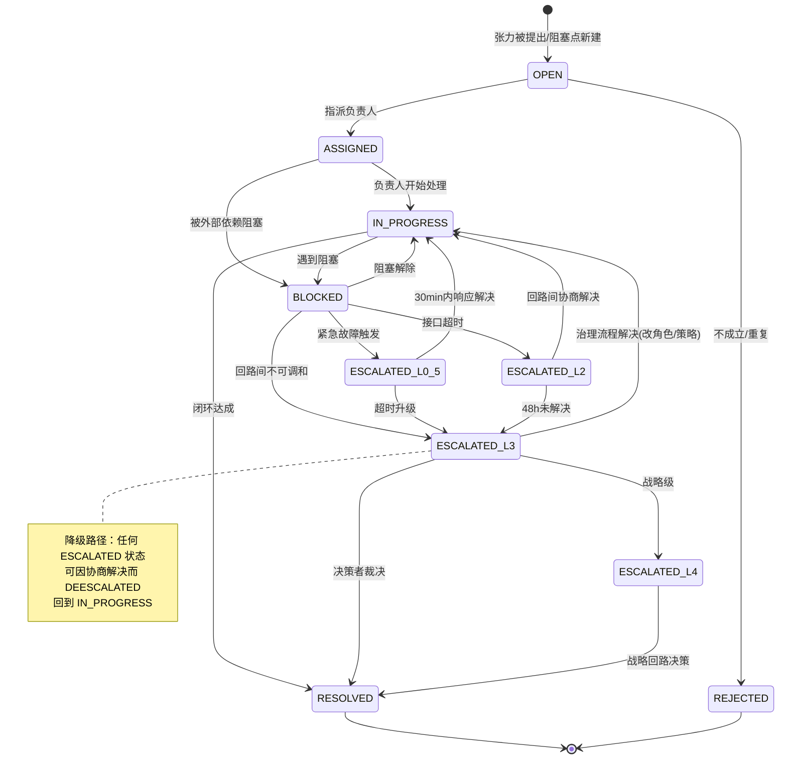

# 回路OS · 冲突升级状态机

> **状态**：v1（review P0 修正：技术 P0-4 状态机缺失 + 治理 P0-3 缺 L0/L0.5）
> **对应 review 问题**：原设计只有"L1→L2→L3→L4"四行描述，零状态枚举、零转移条件、零降级路径、缺人际和紧急路径

---

## 一、review 指出的 5 个缺陷（本文档逐一修正）

| review 缺陷 | 本文档修正 |
|------------|----------|
| 缺失 1：无 L0 人际冲突路径 | 新增 L0：关系层（一对一对话+调解，不可跳过） |
| 缺失 2：无垂直/平权冲突路径 | L3 重新定义：先走治理流程（改角色/策略），无法一致才上升到决策者 |
| 缺失 3：L1 结构性冲突无转治理标准 | 新增判断：角色职责重叠/边界不清 → 直转治理会 |
| 缺失 4：无反复冲突聚合升级 | 新增"反复模式检测"：同类张力月内≥3次自动标"系统性" |
| 缺失 5：无紧急路径 | 新增 L0.5：紧急路径（生产故障 30min 响应窗口） |

**额外修正**：
- 完整状态枚举（9 个状态）
- 每个转移条件量化（基于 SLA、时间、次数，而非"不可调和"这种主观判断）
- 降级路径（DEESCALATED）
- 冲突类型分类（资源/优先级/语义/权力），不同类型走不同路径

---

## 二、冲突类型与升级路径总览

**核心原则修正**：review 治理架构师指出，原 L1-L4 本质是"向上汇报链"，违反 Holacracy 分布式处理。v1 修正为**"先横向后纵向，先治理后裁决"**：

```
冲突发生
  │
  ├─ 是人际/关系冲突？ ──→ L0（关系层，不可跳过）
  │
  ├─ 是生产紧急故障？ ──→ L0.5（紧急路径，30min）
  │
  ├─ 是回路内任务冲突？
  │    ├─ 角色边界不清？ ──→ 直转治理会（L1→治理）
  │    └─ 普通 task 冲突 ──→ L1（战术会当场到人）
  │
  ├─ 是回路间接口冲突？ ──→ L2（次日协商，超时升 L3）
  │
  └─ 是战略级冲突？ ──→ L4（战略回路）
```

**冲突类型分类**（review 技术 2.5.1 缺失 5）：

| 冲突类型 | 示例 | 默认入口 |
|---------|------|---------|
| 资源冲突 | 两个回路抢同一个人时间 | L2 |
| 优先级冲突 | 回路A的P0 vs 回路B的P1 | L2 → L3 |
| 语义冲突 | 对同一需求理解不同 | L1（先澄清）|
| 权力冲突 | 谁有权决定某事项 | 直转治理会（L3 治理流程）|
| 人际冲突 | 沟通风格/信任/价值观分歧 | L0（不可跳过）|

---

## 三、完整状态机（Mermaid）



---

## 四、状态枚举与字段映射

这些状态值即阻塞点表（表 5）"状态"字段的单选选项：

| 状态 | 含义 | 谁可触发 |
|------|------|---------|
| `OPEN` | 已提出，未指派 | 任何人提张力后 |
| `ASSIGNED` | 已指派负责人 | 负责人接受 |
| `IN_PROGRESS` | 处理中 | 负责人 |
| `BLOCKED` | 被外部依赖阻塞 | 负责人标记 |
| `ESCALATED_L0.5` | 紧急升级（生产故障） | 自动/任何人 |
| `ESCALATED_L2` | 回路间接口升级 | 自动（SLA超时）/回路负责人 |
| `ESCALATED_L3` | 治理流程/决策者升级 | 自动（48h未解决）/回路负责人 |
| `ESCALATED_L4` | 战略级升级 | 治理会决议 |
| `RESOLVED` | 已闭环 | 负责人/验收人 |
| `REJECTED` | 不成立/重复 | 回路负责人 |

---

## 五、各级升级路径详述

### L0：关系层（人际冲突，不可跳过）

> review 治理 P0-3 要求新增。组织中最常见的冲突是人际关系，无法在"战术会当场到人"解决。

- **触发**：成员感觉与另一成员存在沟通障碍、信任问题、价值观分歧
- **处理**：
  1. 引导一对一对话（系统提供结构化对话模板）
  2. 可选请求中立方协助调解（教练 Agent 可作为调解引导者，但**不做裁决**）
  3. 一对一无法解决 → 升级到回路负责人（进入 L1）
- **不可跳过**：人际冲突必须先经过 L0 才进入更高层级，否则只会恶化
- **AI 边界**：教练 Agent 可提供对话模板和调解框架，但不判断谁对谁错

### L0.5：紧急路径（生产故障）

> review 治理 P0-3 要求新增。

- **触发**：生产环境故障、安全事件、线上事故，且涉及回路间责任归属冲突
- **处理**：
  1. 即时通知相关人员（机器人加急消息）
  2. **30 分钟响应窗口**
  3. 超时自动升级到 L3（决策者介入）
- **特殊规则**：紧急路径绕过所有中间层，因为生产故障不容等待

### L1：回路内冲突（战术会）

- **触发**：回路内任务/交付冲突
- **处理**：战术会上当场到人（谁负责/何时交付/验收标准）
- **关键修正（review 缺失 3）**：如果冲突是**结构性**的（角色职责重叠、边界不清），**不留在战术会**，直转治理会——通过修改角色定义来解决，而非反复在战术会争论

### L2：回路间接口冲突

- **触发**：回路间接口延迟（**基于 SLA 判断**，SLA 在回路间接口表的 SLA 字段）
- **处理**：
  1. 机器人次日提醒双方回路负责人协商
  2. **超时标准**：超过 SLA 约定时间 + 24h 缓冲
  3. 超时未解决 → 自动升 L3
- **数据依赖**：读取回路间接口表的 SLA 和当前状态字段

### L3：治理流程 / 决策者升级

> review 治理架构师的核心批评："需决策者拍板"是中心化假设。v1 修正为"先治理后裁决"。

- **触发**：
  - L2 超时未解决（自动）
  - 同类张力月内≥3次（反复模式，自动标记"系统性"）
  - 回路负责人主动升级
- **处理（两步）**：
  1. **第一步：治理流程**——在治理会上尝试通过修改角色/策略/回路结构来解决。**任何人提出的张力都可以推动治理变更，不依赖决策者裁决。** 产出决策记录。
  2. **第二步：决策者裁决（最后手段）**——仅当治理流程无法达成一致时，决策者才拍板。**这是兜底，不是默认路径。**
- **关键修正**：从 v2 的"需决策者拍板"改为"先走治理流程，无法一致才上升到决策者"

### L4：战略级冲突

- **触发**：冲突本质是战略分歧（如"做什么样的模型"）
- **处理**：归档到战略回路（回路零）下次会议决策

---

## 六、转移条件量化

所有转移条件**必须量化**，不依赖"不可调和"这种主观判断（review 技术 2.5.1 缺失 2）：

| 转移 | 触发条件 | 数据来源 | 自动/手动 |
|------|---------|---------|---------|
| BLOCKED → ESCALATED_L0.5 | 生产故障标签 | 张力表"张力类型"或人工触发 | 半自动 |
| BLOCKED → ESCALATED_L2 | 接口超 SLA + 24h | 接口表 SLA + 当前状态 | 自动（机器人定时检查）|
| ESCALATED_L2 → ESCALATED_L3 | L2 升级后 48h 未解决 | 阻塞点表"最后更新时间" | 自动 |
| 任意 → ESCALATED_L3 | 同类张力月内≥3次 | 张力表聚合（按涉及回路+类型）| 自动 |
| ESCALATED_L3 → ESCALATED_L4 | 治理会判定为战略级 | 治理会决议 | 手动 |
| 任意 ESCALATED → IN_PROGRESS | 协商解决 | 阻塞点状态更新 | 手动（DEESCALATED）|

---

## 七、降级路径

review 技术 2.5.1 缺失 4 指出：只有升级无降级，L3 会堆积已解决项。

- **任何 ESCALATED 状态**都可因协商解决而 DEESCALATED，回到 IN_PROGRESS
- 降级操作：回路负责人或决策者手动操作，状态改回 IN_PROGRESS
- 降级记录：写入变更审计表，避免反复升降级

---

## 八、自动化的诚实边界

review 技术 2.5.2 指出：真正可自动化的是定时器和规则触发，语义判断不可自动化。

| 可自动化 | 不可自动化（需人类）|
|---------|------------------|
| 定时器：超 SLA 自动标 L2 | "不可调和"的判断 |
| 计数器：月内≥3次自动标"系统性" | 治理流程中的角色修改提案 |
| 48h 无动静标红 | L3 → L4 的战略级判定 |
| 紧急故障标签触发 L0.5 | L0 人际冲突的调解 |

**建议表述**：将"冲突升级自动化"修正为"**自动检测升级信号 + 半自动推荐升级**，由人类确认是否真正升级"。

---

## 九、与各表的字段对应

- **阻塞点表（表 5）"状态"字段**：承载本状态机的所有状态值
- **张力表（表 4）"冲突等级"字段**：L0/L0.5/L1/L2/L3/L4
- **回路间接口表（表 6）"SLA"字段**：L2 升级的判断依据
- **决策记录表（表 8）**：L3 治理流程产出的决议
- **变更审计表（表 9）**：降级和反复升降级的记录
