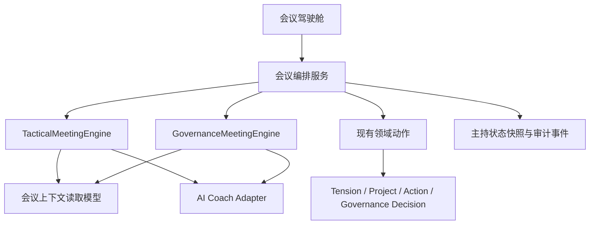
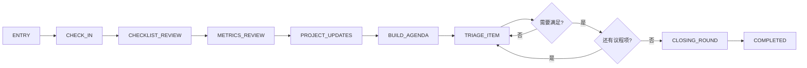
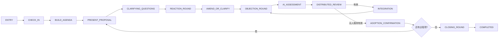

# AI 原生战术与治理会议引导设计

## 状态

- 日期：2026-07-22
- 状态：已获产品确认
- 设计边界：回路制为主，Holacracy 为辅
- 实施路线：独立战术/治理领域编排器

## 目标

将现有以聊天消息和共享阶段为中心的会议智能体，改造为两套真正独立、上下文可追溯、多人实时协作、能驱动现有领域闭环的会议引导系统。

最终体验必须像一场由专业教练实时主持的真实会议，而不是表单工作台或通用聊天机器人：参与者知道当前轮到谁、允许做什么、为什么；教练会基于真实组织事实主动纠偏；会议进展和关键输出在右侧成果板实时形成；所有承诺和治理变更仍由人类确认。

## 已确认的产品决策

1. 采用 LoopOS 混合模型：忠实使用 Holacracy 的会议机制，但不重构全系统为严格 Holacracy v5 权力模型。
2. 战术会议和治理会议拥有完全独立的状态机。
3. AI 可以初步判断治理反对是否有效，并给出四项标准、证据和理由。
4. 任何参会者都可以推翻 AI 初判，不设置主持人特权。
5. 如果不同参与者给出相反判断，只要一人仍主张反对有效，就进入整合。
6. AI 自动推进可客观判断完成的阶段；承诺、治理采纳和会议结束等不可逆节点必须由人类显式确认。
7. 任何参会者可以暂停或回退可逆流程。
8. 会议以真实多人同步为主；单人模式只用于演练，AI 不模拟缺席参与者，也不编造其张力或观点。
9. 左侧提供实时会议引导，右侧实时投影结构化进展和关键输出。

## 方法论基准

本设计以 Holacracy v5 的会议规则和官方主持实践为主要基准：

- [Holacracy Constitution v5](https://www.holacracy.org/constitution/5-0/)
- [Tactical Meetings](https://www.holacracy.org/how-it-works/tactical-meetings/)
- [Facilitating a Holacracy Tactical Meeting](https://www.holacracy.org/blog/facilitating-a-holacracy-tactical-meeting/)
- [Governance Meeting Process](https://www.holacracy.org/r/governance-meeting-process/)
- [Governance Meeting Card v5](https://www.holacracy.org/wp-content/uploads/2024/10/ENGLISH-Governance-Meeting-Card-v5.0.100724.pdf)
- [Understanding Integration](https://www.holacracy.org/blog/holacracy-basics-understanding-integration/)

LoopOS 继承以下核心会议原则：

- 战术会先暴露现实，再构建议程，然后只围绕议程拥有者的需要快速分诊。
- 治理会严格区分提案、澄清、回应、修改、反对、反对测试和逐条整合。
- 治理反对不是投票；有效性取决于损害和角色事实，不取决于人数。
- AI 和流程守护者不能替议程拥有者、提案人、反对者或结果接收者作答。
- 整合后的提案必须重新经过完整反对轮。

## 现状问题

当前实现存在以下结构性缺口：

- 两种会议共享一套治理式阶段序列，战术会被迫经过提案、回应、表决和整合等不适用阶段。
- 教练只读取有限聊天历史、会议标题和在线角色，没有读取真实目标、指标、项目、行动、角色职责、结构提案和反对历史。
- 人格配置和提示词不能约束真实状态迁移，也不能保证领域输出。
- 聊天阶段与已有 `TacticalOutcomeProposal`、`GovernanceDecisionProcess` 相互割裂。
- 当前治理表态接近赞成/反对表决，缺少逐人反对测试、逐条整合和修订后的重新反对轮。
- AI 判断、人工推翻和最终结论没有完整、可查询的审计链。
- 页面刷新式同步不适合真实多人会议，并曾影响输入焦点和草稿。
- 右侧面板只展示统计数量，没有实时呈现会议正在形成的事实、输出和决策。

## 总体架构



### TacticalMeetingEngine

只处理战术会议规则、轮次、议程、时间管理、需求澄清和战术输出。它不包含治理提案、治理反对或结构采纳状态。

### GovernanceMeetingEngine

只处理治理张力、提案修订、澄清、回应、反对测试、分布式人工复核、逐条整合和采纳。它不处理战术项目跟踪或战术分诊。

### MeetingContextBuilder

按 `organizationId + meetingId + representedRoleIds` 构造类型化、带来源引用的上下文快照。它是 AI 可以看到的唯一组织事实入口。

### MeetingCoachAdapter

将类型化上下文转换为模型输入，并将模型输出解析为严格结构化建议。AI 输出先经过 schema 和状态机规则校验，不能直接写业务状态。

### MeetingOrchestrator

负责参与资格、角色代表资格、状态版本、幂等、确定性迁移、自动推进和领域动作调用。它是会议状态写入的唯一入口。

### 会议驾驶舱

左侧展示实时主持和发言轮次，右侧展示结构化成果投影。聊天记录是可读证据，不再是状态真相源。

## 持久化设计

采用“状态快照 + 轻量审计事件”，不把系统改造成完整事件溯源平台。

### MeetingFacilitationSession

一场会议一个活动会话，建议字段：

- `organizationId`
- `meetingId`
- `engineType`: `TACTICAL | GOVERNANCE`
- `phase`
- `phaseState`: 当前轮次、完成集合、时间预算等类型化 JSON
- `activeAgendaItemId`
- `paused`
- `revision`
- `lastEventSequence`
- `startedAt`
- `completedAt`

### MeetingFacilitationEvent

用于增量同步和审计，但不是领域真相源。建议事件包括：

- 参与者加入、离开和代表角色确认
- 发言提交与轮次完成
- 阶段迁移、暂停、恢复和回退
- AI 介入建议、证据引用和置信度
- AI 反对初判、人类推翻及聚合结论
- 候选输出、人工接受、领域动作成功或失败
- 会议结束确认

每条事件具有组织、会议、递增序号、状态版本、操作者、事件类型、结构化载荷和时间戳。

### MeetingAgendaItem

动态议程需要一等结构化记录，而不是从聊天文本推断。建议记录：

- 所属会议与组织
- 所有者及其本次代表角色
- 短标签
- 关联张力或治理提案
- 排序与状态
- 当前需求、分诊结果或治理结果引用
- 创建、开始、完成时间

### 反对判定审计

治理反对至少需要保存：

- 提案和修订版本
- 反对者及其代表角色
- 反对原文和结构化四项标准
- AI 初判、理由、证据引用和置信度
- 每位参与者的维持或推翻结论及理由
- 当前聚合结论
- 对应整合结果和重新反对轮

可以用专用表保存反对和复核，也可由治理流程现有记录扩展；不得只存在于消息 metadata 中。

真实业务结果继续保存在已有 `Tension`、`TacticalOutcomeProposal`、`Project`、Action Tension、`GovernanceDecisionProcess`、`DecisionRecord` 和 `ChangeLog` 中。

## 战术会议状态机



### 入场与角色确认

- 每位参与者选择本次会议代表的一个或多个已授权角色。
- AI 不用笼统姓名推断权责，只按本次代表角色理解请求和承诺。
- 单人演练时明确标注演练，不生成缺席者回应。

### 签到轮

- 逐人发言，不允许回应。
- AI 只负责点名、提醒规则和阻止讨论。

### 检查清单

- 展示角色已配置的周期性承诺。
- 回答 `完成 / 未完成 / 不适用`，不解释、不评判。
- 因结果产生的张力先加入议程线索，稍后处理。
- 若当前数据模型没有持久化清单定义，需要补充最小角色清单模型；不能用 AI 临时编造。

### 指标回顾

- 展示真实最新指标和历史变化。
- 只允许事实澄清；意见和行动请求被暂存为议程线索。

### 项目增量更新

- 只报告自上次会议以来的变化，不重复完整背景。
- 教练根据上次会议和项目历史识别无增量汇报。

### 构建议程

- 每人可以添加任意数量的一到两个词标签。
- 不解释、不讨论；分诊过程中仍可新增。
- 状态机保存拥有者、代表角色、顺序和关联张力。

### 逐项分诊

每项内部包含：

1. David 询问议程拥有者“你需要什么？”
2. AI 判断是否需要最小澄清，并识别候选输出。
3. 允许其他人仅在服务该需要时参与。
4. 捕获被明确接受的下一步行动、Project、信息答复、角色请求或治理张力。
5. 输出接收者必须确认承诺；缺席者只能收到待确认请求。
6. David 询问拥有者是否得到所需；只有拥有者能确认结束。

AI 管理剩余时间和每项公平时间份额，但不能以超时代替拥有者确认。超时时可以建议捕获一个最小下一步或延期。

### 结束轮

- 逐人分享结束感受，不讨论。
- 人类确认结束后生成会议纪要和成果索引。

## 治理会议状态机



### 签到与构建议程

遵守逐人、无回应和短标签规则。任何参与者可以在后续议程项之间继续添加治理张力。

### 提出提案

- 提案人提出最小可行治理变更，可说明来源张力。
- 其他人只有在提案人请求时才能帮助形成初始提案，不能提前优化或寻求共识。
- 提案必须映射为现有治理引擎支持的结构化变更。

### 澄清问题

- 只能提理解性问题，不能夹带观点、游说或反应。
- 提案人可以回答“不作规定”。
- AI 主动识别伪澄清并转为流程解释或提醒留到回应轮。

### 回应轮

- 除提案人外逐人回应，不讨论、不交叉辩论。
- 提案人只听，不逐条辩护。
- UI 显示当前发言人和剩余队列。

### 修改或澄清

- 只有提案人发言。
- 提案人可以修改、澄清或保持原案，无义务吸收所有建议。

### 反对轮

- 包括提案人在内逐人回答是否存在反对。
- 反对不是不喜欢、不需要或不完整，而是提案造成的具体损害。
- 每条反对独立保存和测试，不按人数投票。

### AI 初判与分布式复核

AI 根据以下四类问题初判：

1. 是否描述了对回路目的或职责能力的实质损害，而不只是提案不够好。
2. 损害是否由当前提案新增，而非原本就存在。
3. 反对者是否从其代表角色感知该限制，或是否属于无效治理输出等规则性反对。
4. 判断是否基于已知事实；若是预测，是否无法在严重损害前安全适应。

AI 返回 `VALID | INVALID | INSUFFICIENT_INFO`、逐项依据、证据引用和置信度。

任何参会者都能维持或推翻 AI，并说明理由。聚合规则为：只要一名参与者维持“有效”，反对即进入整合。没有最后写入者获胜或多数票机制。

### 逐条整合

- 一次只整合一条有效反对。
- 从反对者开始询问“可以增加或改变什么来消除该问题？”
- 任何人可以贡献方案，但焦点在反对者和提案人。
- 每个候选方案先问反对者是否消除损害，再问提案人是否仍解决原张力。
- 所有有效反对整合完毕后，必须对新修订重复完整反对轮。

### 采纳与结束

- 只有完整反对轮结束且无人维持有效反对时进入采纳确认。
- 任一参与者可以触发确认；服务端重新验证状态和修订版本。
- 采纳后调用现有规范治理引擎，原子生成结构变更、决策记录、变更日志和来源张力结果。
- 会议结束仍需人类显式确认。

## AI 上下文与教练策略

### MeetingContextSnapshot

每次教练介入前构造上下文快照，包含：

- 组织、回路、角色目的、领域、职责、政策和承担人
- 本次参与者及其代表角色
- 当前阶段、发言轮次、剩余时间和活动议程项
- 战术目标、清单、指标、项目增量、行动和开放张力
- 治理当前结构、提案修订、澄清、回应、反对和整合记录
- 结构化历史结果、滚动摘要和最近相关发言

每个事实带内部来源引用。长会议通过结构化摘要和相关性选择控制上下文，不丢失活动张力、未解决反对或当前提案版本。

### 结构化 AI 输出

```ts
type MeetingCoachSuggestion = {
  speech: string;
  intervention:
    | "PROMPT_TURN"
    | "REDIRECT_DRIFT"
    | "CLARIFY_NEED"
    | "SUGGEST_OUTPUT"
    | "ASSESS_OBJECTION"
    | "EXPLAIN_PROCESS"
    | "NONE";
  evidenceRefs: string[];
  confidence: number;
  suggestedTransition?: string;
  suggestedOutput?: Record<string, unknown>;
  objectionAssessment?: {
    validity: "VALID" | "INVALID" | "INSUFFICIENT_INFO";
    criteria: Array<{
      criterion: string;
      result: string;
      rationale: string;
      evidenceRefs: string[];
    }>;
    rationale: string;
  };
};
```

AI 不对每条消息机械回复。触发点包括：

- 轮次开始或阶段完成
- 检测到不允许的发言类型或讨论偏航
- 议程拥有者需求仍模糊
- 可以捕获结构化输出
- 沉默过久或时间预算告急
- 需要反对初判或流程解释

没有来源时不能陈述组织事实。信息不足时只问一个最小澄清问题。AI 建议必须由引擎验证，不可直接推进状态或写入领域对象。

### David 的教练策略

- 简洁、快速、聚焦议程拥有者的需要。
- 主动阻止泛泛讨论和每个人都发表意见。
- 听取可捕获的请求和输出，而不是替参与者解决问题。
- 每项结束前确认“你得到需要的东西了吗？”

### Brian 的教练策略

- 保护提案人自主权，同时鼓励真实反对。
- 严格区分澄清、回应、修改、反对和整合空间。
- 对反对进行可解释初判，但明确标注为可推翻建议。
- 整合时寻找最小改动，不追求完美或共识。

两个人格只借鉴方法和风格，不宣称智能体就是相关真人。

## 多人实时协作

采用服务端权威快照、递增事件序号和客户端增量归并：

- 客户端按事件游标获取阶段、发言、在线状态、成果和 AI 介入更新。
- 不通过整页刷新同步，因此远端消息不能清空输入或抢走焦点。
- 连接中断后从最后序号补齐事件。
- 每个写操作包含预期状态版本和幂等键。
- 版本冲突时刷新最新状态并保留未提交草稿。
- 不可逆操作在离线时禁止提交，不能假装成功。

实时传输优先采用无需新增外部依赖、可在当前 Next.js 运行环境稳定工作的增量事件接口。可以使用流式响应；若运行环境不支持稳定长连接，则使用短间隔游标拉取作为降级。无论传输方式如何，都必须满足同一事件、版本和恢复契约。

## 双屏会议驾驶舱

桌面端采用左侧实时主持、右侧结构化成果板：

```text
┌──────────────────────────────────────┬──────────────────────────┐
│ 实时会议引导                         │ 结构化会议成果板           │
│ 当前阶段 / 当前发言角色 / 剩余时间    │ 流程进度与完成条件          │
│ 教练主持、参与者发言和流程纠偏        │ 当前议程项和结构化事实       │
│ 输入区、快捷动作和暂停入口            │ 候选输出、确认和领域结果     │
└──────────────────────────────────────┴──────────────────────────┘
```

### 战术成果板

- 检查项、指标、项目增量和风险信号
- 张力议程、拥有者、顺序和处理状态
- 当前需要及本人确认状态
- 候选和正式 Action、Project、信息请求、治理张力
- 负责人、期限、验收标准和来源链路
- 每项“是否得到所需”和处理时间

### 治理成果板

- 来源张力、提案人及其代表角色
- 当前结构与提议结构差异
- 澄清和回应轮完成度
- 当前修订
- 每条反对的四项测试、AI 初判、人类复核和聚合状态
- 逐条整合的双重确认
- 重新反对轮进度
- 待确认治理变更及采纳后的领域链接

左侧一旦产生可结构化内容，右侧立即出现候选卡。候选卡经有权人确认后才变为正式结果。点击成果卡可以定位对应发言和判断证据。右侧是现有领域状态和主持状态的投影，不建立平行真相源。

移动端将成果板变为可展开抽屉；关键确认节点主动提示，但不能打断用户正在输入的内容。

## 权限模型

- 只有正确组织内、被邀请的真实会议参与者可以读写会话。
- 代表角色必须来自当前有效任职或明确代理授权。
- 任何参与者可以增加议程、请求解释、暂停、恢复、回退可逆流程和推翻 AI 初判。
- 议程拥有者控制自己的张力是否处理完成。
- 战术承诺的接收者控制是否接受；缺席者不会被自动承诺。
- 治理提案人控制提案和修订。
- 反对者控制反对内容及整合是否消除损害。
- 任一参与者可以在合法终态触发采纳，但服务端必须再次验证完整反对轮和当前修订。
- 已落地领域结果不能通过会议回退静默删除，只能通过明确更正动作处理。

所有写操作验证组织、会议、参与者、代表角色、状态版本和对象版本。客户端提交的阶段、身份和修订不被直接信任。

## 降级与错误处理

### AI 不可用

使用当前阶段对应的确定性主持语继续会议。反对判断返回信息不足，交给分布式人工复核。AI 失败不能阻塞状态机和领域动作。

### AI 输出无效

无效 schema、无事实来源、越权迁移或虚构字段被拒绝。界面不将其展示为正式输出，只保留原始发言并要求本人确认或修正。

### 实时连接中断

保留本地草稿，停止不可逆提交，用游标补齐事件并恢复状态。

### 领域动作失败

停留在当前确认节点，成果卡显示具体失败原因和重试入口。在数据库写入成功前不能显示为已创建或已采纳。

### 并发冲突

只有第一个符合预期版本的迁移成功。其他客户端补齐最新事件，重新计算可用动作。幂等键防止重连和重复点击产生重复领域结果。

## 测试与验收

### 纯状态机测试

- 两套独立阶段和所有合法转换
- 发言轮次、暂停、恢复、回退和非法跳转
- 自动推进边界
- 所有不可逆节点的人类确认门槛

### 上下文与安全测试

- 正确组织、会议、回路、角色和对象范围
- 跨租户、错误会议、非参与者和虚假代表角色拒绝
- 长会议压缩后保留活动张力、反对和提案版本
- AI 事实引用只来自上下文

### 教练输出契约测试

- 非法结构和越权建议拒绝
- David 正确区分请求和候选战术输出
- Brian 正确区分治理发言空间和常见偏航
- AI 不替人类角色作答

### 反对与分布式复核测试

- AI 有效、无效和信息不足路径
- 任一参与者推翻后聚合结论更新
- 相反人类判断并存时保持有效
- 修订后旧判断归档并重新测试
- 整合后完整重新反对
- 并发和重复操作保持全部审计证据

### 领域集成测试

- 战术结果只通过现有战术提案和决策动作落地
- 治理结果只通过现有规范治理引擎落地
- 领域对象、来源张力、会议、决策和变更日志一致
- 聊天和 AI 无法绕过领域授权

### 多客户端浏览器验收

至少两个独立身份验证：

- 同时加入并选择不同代表角色
- 阶段、轮次、在线状态和右侧成果在两秒内同步
- 接收远端事件时不丢输入焦点或草稿
- 断网重连补齐、不重复
- 并发推进单一成功
- 移动端成果抽屉可完成全部确认

### 完整场景

1. 战术指标异常进入议程，David 阻止提前讨论，形成并接受 Action，拥有者确认满足。
2. 模糊战术张力经最小澄清形成 Project，保存负责人和预期结果。
3. 治理提案经历伪澄清纠偏、回应、AI 无效判断、无人维持有效和人工采纳。
4. AI 判断无效后被任一参与者推翻，完成整合、重新反对和采纳。
5. 相反人类判断并存，保护性进入整合。
6. AI 不可用时两种会议仍完成真实领域结果。

### 完成门槛

- 状态机合法转换测试 100% 通过。
- 跨租户和越权写入为零。
- 基准场景中虚构组织事实为零。
- 所有正式输出拥有来源引用。
- 多客户端同步目标小于两秒。
- 专家场景在流程忠实度、上下文依据、介入时机、简洁度和人类自主权上均达到 4/5 以上。
- AI 反对初判在人工标注集达到至少 85%，同时人类推翻能力必须 100% 可用。
- 静态、领域、数据库、多人浏览器和真实模型评估分别报告，不相互替代。

## 实施边界

### 范围内

- 两套独立会议引擎
- 结构化主持状态、议程和审计
- 上下文读取模型和结构化 AI 适配器
- 分布式反对复核
- 多人增量同步
- 左右双屏会议驾驶舱
- 与现有战术和治理领域动作的连接
- 自动化和浏览器验收

### 范围外

- 将 LoopOS 整体重构为严格 Holacracy v5
- 让 AI 模拟缺席参与者
- 让 AI 自动承诺、自动采纳或替人类结束会议
- 完整事件溯源平台
- 新增外部实时 SaaS 依赖，除非现有运行环境无法满足已确认体验且另行获批
- 顺手重构与会议无关的领域模块

## 迁移原则

- 现有会议和消息历史保持可读。
- 新引擎只接管未结束且显式初始化的新会话；不能从旧聊天猜测出不可验证状态。
- 旧 `currentPhase` 在迁移期只作为兼容展示，新的主持会话是阶段真相源。
- 现有战术和治理领域写入路径保持唯一权威，不复制业务逻辑。
- 每个切换步骤必须有可回滚路径，且不得破坏已采纳治理结果或已创建战术结果。
